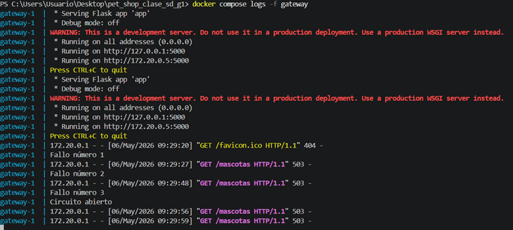
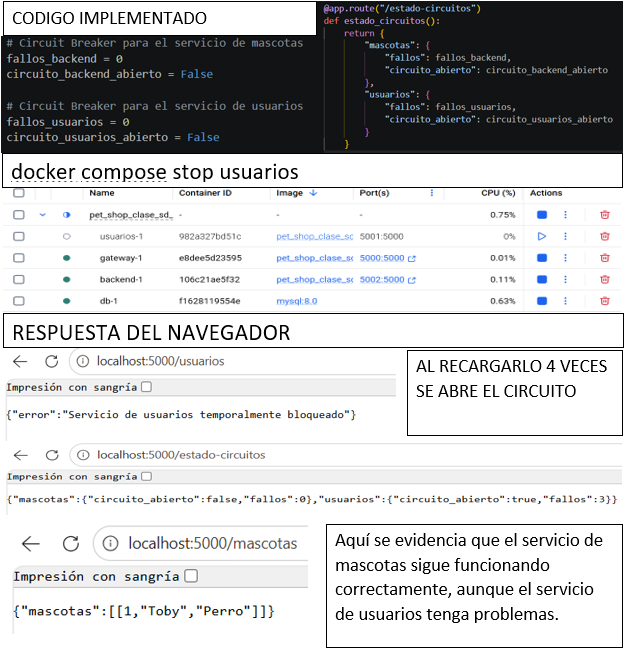
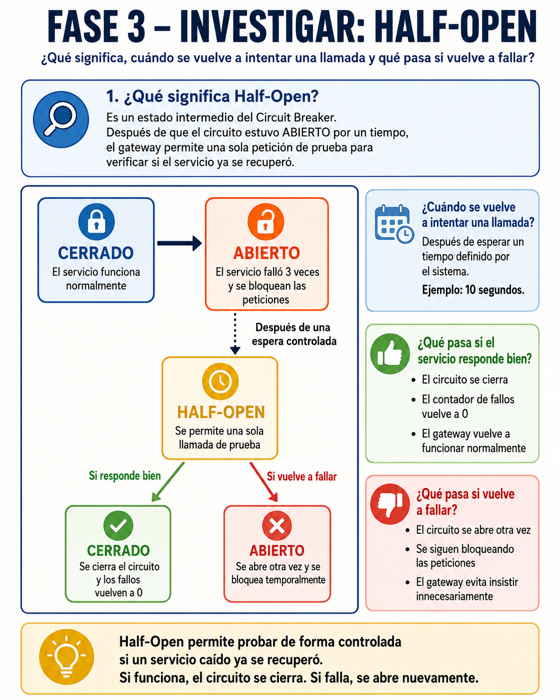

# Laboratorio: Sistema que aprende a fallar

## FASE 1 – OBSERVAR  
### Sin modificar código

---

## Apagar el servicio de mascotas

- Lo apagué manualmente desde Docker, deteniendo únicamente el contenedor del servicio de mascotas.

El contenedor apagado fue:

```txt
backend-1
```

Este contenedor corresponde al servicio de mascotas.

- También lo apagué usando el comando en la terminal:

```bash
docker compose stop backend
```

Se verificó que el servicio se apagó correctamente para poder seguir con las pruebas.

---

## Hacer varias peticiones al Gateway

A la hora de hacer las peticiones, ingresé varias veces al endpoint del gateway:

```txt
http://localhost:5000/mascotas
```

Después de realizar varias peticiones, el sistema respondió con el siguiente mensaje:

```json
{
  "error": "Servicio temporalmente bloqueado"
}
```

Esto quiere decir que el gateway detectó varios fallos del servicio de mascotas y decidió bloquear temporalmente las llamadas hacia ese servicio.

---

## Revisar logs

Para revisar los logs del gateway, se ejecutó el siguiente comando en la terminal:

```bash
docker compose logs -f gateway
```

En los logs se evidenció lo siguiente:

```txt
Fallo número 1
Fallo número 2
Fallo número 3
Circuito abierto
```

El gateway ya detectó varios fallos del servicio de mascotas y decidió dejar de insistir.

---

## Responder

### ¿Qué hace el sistema actualmente?

El sistema intenta llamar al servicio de mascotas. Como el servicio está apagado, empieza a contar los fallos.

Después de varios intentos fallidos, el Circuit Breaker abre el circuito y el gateway deja de enviar más peticiones al backend de mascotas.

---

### ¿Se protege o insiste?

El sistema se protege, porque después de 3 fallos deja de insistir y responde directamente con el mensaje:

```json
{
  "error": "Servicio temporalmente bloqueado"
}
```

Esto se evidencia en la siguiente parte del código:

```python
if circuito_abierto:
    return {"error": "Servicio temporalmente bloqueado"}, 503
```

Cuando el circuito está abierto, el gateway ya no intenta comunicarse con el servicio de mascotas, sino que responde directamente con un error controlado.

---

## Explicación de lo observado

La cantidad de fallos permite verificar que el gateway intentó comunicarse con el servicio de mascotas.

Como el servicio estaba apagado, el sistema empezó a contar los errores. Al llegar a 3 fallos, abrió el circuito y respondió con el error:

```json
{
  "error": "Servicio temporalmente bloqueado"
}
```

Esto demuestra que el sistema no sigue insistiendo de manera indefinida, sino que se protege cuando detecta que un servicio no está disponible.

---

## Evidencia de la Fase 1

En la siguiente evidencia se muestra el comportamiento del sistema durante la Fase 1:



---

## Conclusión de la Fase 1

En esta fase se comprobó que el sistema ya cuenta con un Circuit Breaker básico en el endpoint `/mascotas`.

Cuando el servicio de mascotas se apaga, el gateway intenta comunicarse con él. Si la comunicación falla, el sistema empieza a contar los fallos. Al llegar al tercer fallo, el circuito se abre y el gateway deja de insistir.

Sin embargo, esta implementación todavía es básica, porque cuando el circuito queda abierto no intenta recuperarse automáticamente. Por eso, en las siguientes fases se debe implementar la lógica de recuperación usando el estado Half-Open.

# FASE 2 – APLICAR  
## Extensión del Circuit Breaker

En esta fase se aplicó el mismo comportamiento del Circuit Breaker que ya existía en el endpoint `/mascotas`, pero ahora también para el endpoint `/usuarios`.

La idea principal fue no cambiar completamente la estructura del código, sino adaptar la lógica que ya se tenía en clase para que cada servicio tuviera su propio control de fallos.

---

## Objetivo de la fase

El objetivo de esta fase fue extender el Circuit Breaker a otros endpoints del gateway, principalmente:

```txt
/usuarios
/mascotas
```

De esta manera, si falla el servicio de usuarios, solo se bloquea temporalmente `/usuarios`, pero `/mascotas` puede seguir funcionando normalmente.

---

## Código implementado en gateway/app.py

El archivo modificado fue:

```txt
gateway/app.py
```

El código quedó de la siguiente manera:

```python
from flask import Flask, request, jsonify
import requests

app = Flask(__name__)

# Circuit Breaker para el servicio de mascotas
fallos_backend = 0
circuito_backend_abierto = False

# Circuit Breaker para el servicio de usuarios
fallos_usuarios = 0
circuito_usuarios_abierto = False


@app.route("/usuarios")
def usuarios():
    global fallos_usuarios, circuito_usuarios_abierto

    if circuito_usuarios_abierto:
        return {"error": "Servicio de usuarios temporalmente bloqueado"}, 503

    try:
        response = requests.get("http://usuarios:5000/usuarios", timeout=2)
        fallos_usuarios = 0
        return jsonify(response.json())

    except:
        fallos_usuarios += 1
        print(f"Fallo número {fallos_usuarios} en usuarios", flush=True)

        if fallos_usuarios >= 3:
            circuito_usuarios_abierto = True
            print("Circuito abierto para usuarios", flush=True)

        return {"error": "Servicio de usuarios no disponible"}, 503


@app.route("/mascotas")
def mascotas():
    global fallos_backend, circuito_backend_abierto

    if circuito_backend_abierto:
        return {"error": "Servicio de mascotas temporalmente bloqueado"}, 503

    try:
        response = requests.get("http://backend:5000/mascotas", timeout=2)
        fallos_backend = 0
        return response.json()

    except:
        fallos_backend += 1
        print(f"Fallo número {fallos_backend} en mascotas", flush=True)

        if fallos_backend >= 3:
            circuito_backend_abierto = True
            print("Circuito abierto para mascotas", flush=True)

        return {"error": "Servicio de mascotas no disponible"}, 503


@app.route("/estado-circuitos")
def estado_circuitos():
    return {
        "mascotas": {
            "fallos": fallos_backend,
            "circuito_abierto": circuito_backend_abierto
        },
        "usuarios": {
            "fallos": fallos_usuarios,
            "circuito_abierto": circuito_usuarios_abierto
        }
    }


if __name__ == "__main__":
    app.run(host="0.0.0.0", port=5000)
```

---

## Explicación del código implementado

Primero se separaron los contadores de fallos para cada servicio.

Para el servicio de mascotas se dejó:

```python
fallos_backend = 0
circuito_backend_abierto = False
```

Para el servicio de usuarios se agregó:

```python
fallos_usuarios = 0
circuito_usuarios_abierto = False
```

Esto permite que cada servicio tenga su propio Circuit Breaker.

---

## Circuit Breaker para usuarios

En el endpoint `/usuarios`, primero se valida si el circuito ya está abierto:

```python
if circuito_usuarios_abierto:
    return {"error": "Servicio de usuarios temporalmente bloqueado"}, 503
```

Si el circuito está abierto, el gateway no intenta llamar al servicio de usuarios.  
Responde directamente con un error controlado.

Después, si el circuito está cerrado, intenta comunicarse con el servicio:

```python
response = requests.get("http://usuarios:5000/usuarios", timeout=2)
```

Si el servicio responde correctamente, el contador de fallos vuelve a cero:

```python
fallos_usuarios = 0
```

Pero si el servicio falla, entra al `except` y aumenta el contador:

```python
fallos_usuarios += 1
```

Cuando llega a tres fallos, el circuito se abre:

```python
if fallos_usuarios >= 3:
    circuito_usuarios_abierto = True
    print("Circuito abierto para usuarios", flush=True)
```

---

## Circuit Breaker para mascotas

El Circuit Breaker de mascotas conserva la misma idea trabajada en clase.

Si el circuito está abierto, responde:

```python
if circuito_backend_abierto:
    return {"error": "Servicio de mascotas temporalmente bloqueado"}, 503
```

Si el servicio de mascotas responde bien, reinicia el contador de fallos:

```python
fallos_backend = 0
```

Si falla, aumenta el contador:

```python
fallos_backend += 1
```

Y cuando llega a tres fallos, abre el circuito:

```python
if fallos_backend >= 3:
    circuito_backend_abierto = True
    print("Circuito abierto para mascotas", flush=True)
```

---

## Endpoint agregado para revisar el estado de los circuitos

También se agregó el endpoint:

```txt
/estado-circuitos
```

Este endpoint permite ver el estado actual de los circuitos del sistema.

Código implementado:

```python
@app.route("/estado-circuitos")
def estado_circuitos():
    return {
        "mascotas": {
            "fallos": fallos_backend,
            "circuito_abierto": circuito_backend_abierto
        },
        "usuarios": {
            "fallos": fallos_usuarios,
            "circuito_abierto": circuito_usuarios_abierto
        }
    }
```

Este endpoint muestra si el circuito de mascotas o usuarios está abierto o cerrado.

Ejemplo de respuesta:

```json
{
  "mascotas": {
    "circuito_abierto": false,
    "fallos": 0
  },
  "usuarios": {
    "circuito_abierto": false,
    "fallos": 0
  }
}
```

---

## Comandos utilizados

Después de modificar el archivo `gateway/app.py`, se reconstruyó el gateway para que tomara los cambios:

```bash
docker compose up -d --build gateway
```

Luego se verificó que los contenedores estuvieran activos:

```bash
docker compose ps
```

También se inició nuevamente el backend de mascotas, porque en la fase anterior se había apagado:

```bash
docker compose start backend
```

Y se verificó que el servicio de usuarios estuviera activo:

```bash
docker compose start usuarios
```

---

## Pruebas realizadas

Primero se probó que el endpoint de usuarios funcionara correctamente:

```txt
http://localhost:5000/usuarios
```

Respuesta esperada:

```json
[
  {
    "id": 1,
    "nombre": "Mariani"
  },
  {
    "id": 2,
    "nombre": "Carlos"
  }
]
```

Luego se probó que el endpoint de mascotas siguiera funcionando:

```txt
http://localhost:5000/mascotas
```

Respuesta esperada:

```json
{
  "mascotas": [
    [
      1,
      "Toby",
      "Perro"
    ]
  ]
}
```

También se probó el nuevo endpoint de estado de circuitos:

```txt
http://localhost:5000/estado-circuitos
```

Respuesta esperada:

```json
{
  "mascotas": {
    "circuito_abierto": false,
    "fallos": 0
  },
  "usuarios": {
    "circuito_abierto": false,
    "fallos": 0
  }
}
```

---

## Prueba apagando el servicio de usuarios

Para comprobar que el Circuit Breaker también funciona en usuarios, se apagó el servicio de usuarios con el siguiente comando:

```bash
docker compose stop usuarios
```

Luego se realizaron varias peticiones al endpoint:

```txt
http://localhost:5000/usuarios
```

Después de varios intentos fallidos, el sistema respondió:

```json
{
  "error": "Servicio de usuarios temporalmente bloqueado"
}
```

Esto indica que el Circuit Breaker de usuarios se abrió correctamente.

---

## Verificación del estado de los circuitos

Después de apagar usuarios y realizar varias peticiones, se revisó nuevamente:

```txt
http://localhost:5000/estado-circuitos
```

El resultado esperado fue similar al siguiente:

```json
{
  "mascotas": {
    "circuito_abierto": false,
    "fallos": 0
  },
  "usuarios": {
    "circuito_abierto": true,
    "fallos": 3
  }
}
```

Esto demuestra que el circuito de usuarios se abrió, pero el circuito de mascotas siguió cerrado.

---

## Comprobación de independencia entre servicios

Después de que el servicio de usuarios falló, se probó el endpoint de mascotas:

```txt
http://localhost:5000/mascotas
```

El servicio de mascotas siguió funcionando correctamente.

Esto demuestra que los circuitos son independientes:

```txt
Si falla usuarios, no se afecta mascotas.
Si falla mascotas, no se afecta usuarios.
```

---

## Logs del gateway

Para revisar los logs del gateway se usó el comando:

```bash
docker compose logs -f gateway
```

En los logs se pudo evidenciar el comportamiento del Circuit Breaker para usuarios:

```txt
Fallo número 1 en usuarios
Fallo número 2 en usuarios
Fallo número 3 en usuarios
Circuito abierto para usuarios
```

Esto demuestra que el gateway detectó los fallos del servicio de usuarios y abrió el circuito después del tercer intento fallido.

---

## Respuestas del análisis

### ¿Cada servicio debe tener su propio contador de fallos?

Sí. Cada servicio debe tener su propio contador de fallos, porque no todos los servicios fallan al mismo tiempo.

En este caso se manejaron dos contadores:

```python
fallos_backend = 0
fallos_usuarios = 0
```

El contador `fallos_backend` controla los fallos del servicio de mascotas.  
El contador `fallos_usuarios` controla los fallos del servicio de usuarios.

---

### ¿El circuito debe abrirse de forma independiente por servicio?

Sí. El circuito debe abrirse de manera independiente por cada servicio.

Por ejemplo, si falla el servicio de usuarios, solo se abre el circuito de usuarios:

```python
circuito_usuarios_abierto = True
```

Pero el circuito de mascotas puede seguir cerrado:

```python
circuito_backend_abierto = False
```

Esto permite que el sistema siga funcionando parcialmente aunque un servicio falle.

---

### ¿Qué pasa si falla un servicio pero el otro sigue funcionando?

Si falla un servicio, el gateway debe bloquear temporalmente solo ese servicio.

Por ejemplo, si se apaga usuarios:

```txt
/usuarios → falla y abre circuito
/mascotas → sigue funcionando
```

Esto ayuda a que el sistema no se caiga completamente por la falla de un solo servicio.

---

## Evidencia de la Fase 2

En esta fase se debe guardar la evidencia en:

```txt
corte_3/laboratorio_circuit_breaker/evidencias/fase2.png
```

La evidencia debe mostrar:

- El servicio de usuarios apagado.
- El mensaje de servicio temporalmente bloqueado.
- El endpoint `/estado-circuitos`.
- Los logs donde se vea que se abrió el circuito de usuarios.

Ejemplo de imagen en el README:

```md

```


---

## Conclusión de la Fase 2

En esta fase se extendió el Circuit Breaker al endpoint `/usuarios`, manteniendo la lógica sencilla trabajada en clase.

También se separaron los contadores de fallos para que cada servicio tenga su propio control.  
Gracias a esto, si el servicio de usuarios falla, solo se abre el circuito de usuarios y el servicio de mascotas puede seguir funcionando.

Esto mejora el comportamiento del gateway porque evita que una falla en un servicio afecte todo el sistema.

# FASE 3 – INVESTIGAR  
## Half-Open

En esta fase se investigó el concepto de **Half-Open**, el cual hace parte del patrón Circuit Breaker.

Actualmente, el sistema ya puede abrir el circuito cuando un servicio falla varias veces. Sin embargo, todavía tiene una limitación: cuando el circuito se abre, queda bloqueado y no intenta recuperarse automáticamente.

Por esta razón se analiza el estado **Half-Open**, que permite realizar una prueba controlada para verificar si el servicio que estaba fallando ya volvió a funcionar.

---

## ¿Qué significa Half-Open?

Half-Open significa “medio abierto”.

Es un estado intermedio del Circuit Breaker. Se utiliza después de que el circuito ha estado abierto durante un tiempo determinado.

En este estado, el gateway permite realizar una sola petición de prueba hacia el servicio que estaba fallando.

Si esa petición funciona correctamente, el circuito se cierra.  
Si la petición falla, el circuito se vuelve a abrir.

---

## ¿Cuándo se vuelve a intentar una llamada?

La llamada se vuelve a intentar después de esperar un tiempo definido por el sistema.

Por ejemplo, si el circuito se abre porque el servicio falló tres veces, el sistema puede esperar 10 segundos antes de intentar nuevamente una conexión.

El comportamiento sería el siguiente:

```txt
Servicio falla varias veces
↓
Circuito abierto
↓
Espera controlada
↓
Prueba en estado Half-Open
```

---

## ¿Qué pasa si el servicio responde bien?

Si el servicio responde bien durante la prueba Half-Open, significa que ya se recuperó.

En ese caso:

```txt
Half-Open
↓
Servicio responde correctamente
↓
Circuito cerrado
↓
Contador de fallos vuelve a cero
```

Después de esto, el gateway vuelve a enviar las peticiones normalmente al servicio.

---

## ¿Qué pasa si el servicio vuelve a fallar?

Si el servicio vuelve a fallar durante la prueba Half-Open, significa que todavía no está disponible.

En ese caso:

```txt
Half-Open
↓
Servicio falla otra vez
↓
Circuito abierto nuevamente
↓
Se bloquean las peticiones temporalmente
```

Esto evita que el gateway siga insistiendo sobre un servicio que todavía está caído.

---

## Diferencia con la implementación actual

En la implementación actual, cuando el circuito se abre, queda bloqueado y no se recupera automáticamente.

Con Half-Open, el sistema mejora porque después de un tiempo hace una prueba controlada.  
Esto permite que el gateway pueda volver a funcionar normalmente cuando el servicio se recupere.

---

## Evidencia de la Fase 3

La evidencia de esta fase se debe guardar en:

```txt
corte_3/laboratorio_circuit_breaker/evidencias/fase3.png
```

La evidencia puede mostrar la explicación del estado Half-Open o un diagrama sencillo del comportamiento:

```txt
CERRADO → ABIERTO → HALF-OPEN → CERRADO
```

o también:

```txt
CERRADO → ABIERTO → HALF-OPEN → ABIERTO
```



---

## Conclusión de la Fase 3

Half-Open permite que el Circuit Breaker no quede bloqueado de forma permanente.

Este estado ayuda a que el sistema pueda probar si un servicio caído ya volvió a funcionar. Si responde bien, el circuito se cierra. Si vuelve a fallar, el circuito se abre nuevamente.

Gracias a esto, el gateway se vuelve más resiliente porque no solo detecta fallos, sino que también puede intentar recuperarse de forma controlada.

